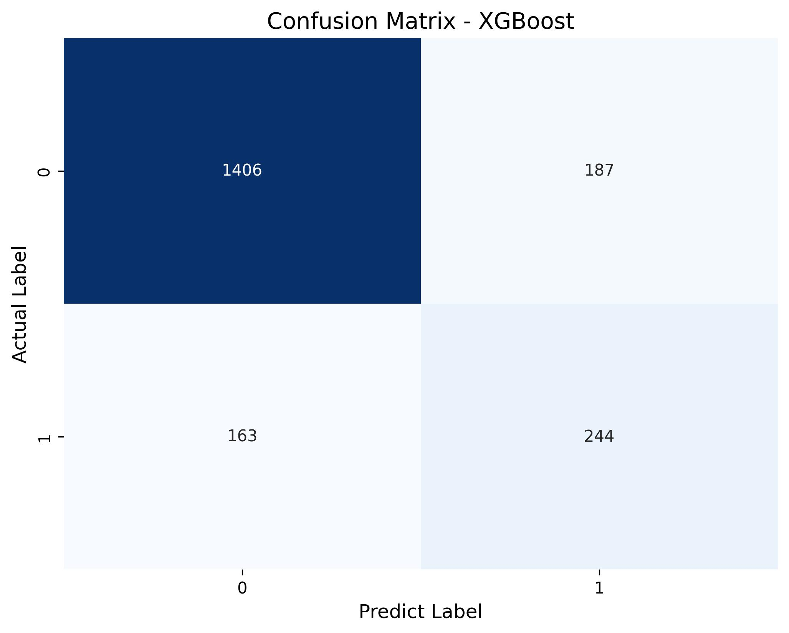
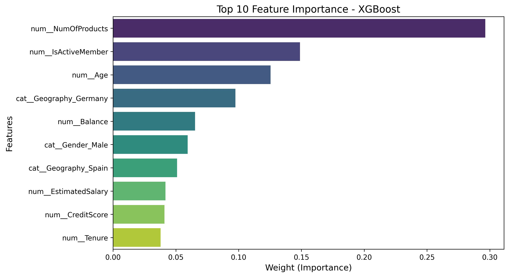

# MLOps Introduction: Final Project
FInal work description in  the [final_project_description.md](final_project_description.md) file.

Student info:
- Full name: Jose Antonio Uscuchagua Flores
- e-mail: juscuchaguaf@uni.pe
- Grupo: 1

## Project Name: [Bank Customer Churn Prediction using MLOps]

### Phase A: Problem Definition
This project implements a complete Machine Learning Operations (MLOps) pipeline to predict customer churn in a banking institution. The goal is to identify which customers are most likely to close their accounts, allowing the bank to take preventive actions.

### Phase B: Project Preparation
The project follows a standard modular Data Science structure, managed via Git and GitHub, ensuring a clear separation between raw data, notebooks, source code, models, and reports.

### Phase C: ML Experimentation
During the experimentation phase, multiple algorithms were evaluated (Logistic Regresion, Random Forest, XGBoost) using Jupyter Notebooks. The definitive champion model was **XGBoost**, achieving and **F1-score of 0.58** on the test data. 

**Metric Analysis & Real-World Reflection:**
*While our initial goal defined in the `PROBLEM_DEFINITION.md` was an F1-Score of 0.75, achieving 0.58 on the first iteration reflects the complex and highly imbalanced nature of real-world banking data. This v1.0 model establishes a solid and functional baseline. To bridge the gap towards the 0.75 target in future ML Lifecycles, next steps would involve deeper Feature Engineering, hyperparameter optimization, and advanced minority class oversamplin (e.g., SMOTE).*

**MLflow Tracking & Registry:**
Experiments were tracked using MLflow. The champion model has been successfully registered in the platform for versioning and production control:

**Model Evaluation Results:**
Below are the key evaluation metrics visualized for the champion model:
* **Confusion Matrix:**

> **Business Interpretation:** As observed in the matrix, the model succesfully identifies 244 customers who are likely to churn (True Positives), allowing the bank to proactively target them with retention campaigns. However, it misses 163 churners (False Negatives). The high number of correctly identified loyal customers (1406 True Negatives) is consistent with the imbalanced nature of the dataset, where the model naturally biases towards the majority class.

* **Feature Importance**

> **Business Interpretation:** The analysis reveals that the number of products a customer holds (`NumOfProducts`) is by far the strongest predictor of churn. This is followed closely by their engagement level (`IsActiveMember`) and their `Age`. Furthermore, being located in Germany (`Geography_Germany`) appears to be the most influential geographic factor. From a business perspective, these insights suggest that the bank should focus its retention strategies on cross-selling to increase product adoption, boosting day-to-day engagement, and creating customized campaigns for specific age demographics.

### Phase D: ML Development Activities
Modular Python code(`src/`) was created for automated data preparation (`data_preparation.py`) and model training (`train.py`). The final model, along with its preprocessing pipeline, has been serialized (`champion_model.pkl`) and is ready for production.

**Data Dictionary:**
A detailed description of all features (variables) used in the final training dataset can be found in the [Data Dictionary](data/data_dictionary.md).

### Phase E: Model Deployment & Serving
The final XGBoost model has been deployed using a REST API built with **Flask**.

Example of a successful request using `curl`:

### Phase F: Delivery & Best Practices
The final project has been packaged and delivered following industry MLOps best practices:
* **Centralized Documentation:** This `README.md` serves as the central hub, linking to relevant scripts, notebooks, data dictionaries, and visual reports.
* **Version Control** All development was conducted on dedicated feature branches (e.g., `feature/fase-e-api`, `docs/fase-f-delivery`) and merged into the `main` branch via structured Pull Requests.
* **Reproducibility:** The repository contains all necessary code, datasets (`data/raw/`), and serialized models (`models/`) to reproduce the complete pipeline.

### Extra Iniciatives & Next Steps
As part of the continuos improvement of the ML lifecycle, the following optional items have been addressed or planned:
- [x] **MLflow Integration:** Implemented experiment tracking and model registry (Phase C & D).
- [ ] **Docker Containerization:** Wrap the Flask REST API inside a Docker container to ensure isolated, reproducible, and cross-platform deployments.