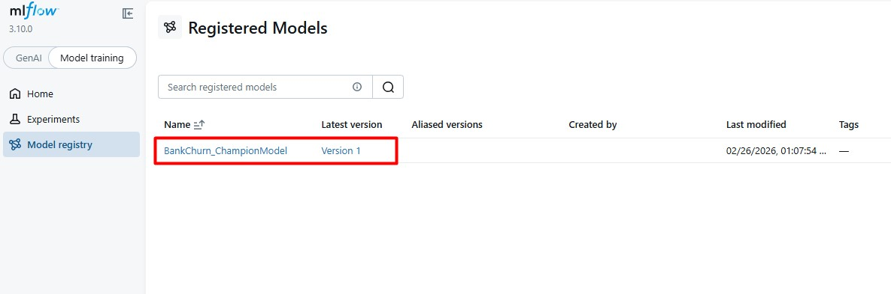

# MLOps Introduction: Final Project
FInal work description in  the [final_project_description.md](final_project_description.md) file.

Student info:
- Full name: Jose Antonio Uscuchagua Flores
- e-mail: juscuchaguaf@uni.pe
- Grupo: 1

## Project Name: [Bank Customer Churn Prediction using MLOps]

### Description:
Este proyecto implementa un pipeline completo de Machine Learning Operations (MLOPS) para predecir  el abandono de clientes (Customer Churn) en una institución bancaria. El objetivo es identificar qué clientes tienen mayor probabilidad de cerrar sus cuentas, permitiendo al banco tomar acciones preventivas.

### Implementation Doc (Arquitecture)
El proyecto sigue una estructura modular estándar de DataScience:
* **Fase de Experimentación:** Jupyter Notebooks integrados con **MLflow** para el rastreo de experimentos, hiperparámetros y métricas.
* **Fase de Desarrollo (Scripts):** Código modular de Python (`src/`) para la preparación automatizada de datos (`data_preparation.py`) y el entrenamiento del modelo (`train.py`)
* **Fase de Despliegue (Deployment):** [Esta sección lo llenaremos en la siguiente etapa con la API].

### Results
Durante la fase de experimentación se evaluaron múltiples algoritmos (Logistic Regression, Radom Forest, XGBoost).
El modelo campeón definitivo fue **XGBoost**, logrando un **F1-Score de 0.58** en los datos de prueba. El modelo final, junto con su pipeline de preprocesamiento, ha sido serializado (`champion_model.pkl`) y está listo para producción.

### MLflow Model Registry
El modelo campeón ha sido registrado exitosamente en la plataforma de MLflow para su versionamiento y control en producción:

### TODO:
-[x] Completar la fase de ML Experimentations (Fase C)

-[x] Completar la fase de ML Development Activities con scripts de preparación y entrenamiento (Fase D).

-[ ] Desarrollar la API web para servir el modelo en tiempo real (Fase E).

-[ ] Contenerizar la aplicación usando Docker (Opcional/Siguiente paso).

