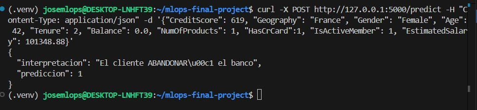

# MLOps Introduction: Final Project
FInal work description in  the [final_project_description.md](final_project_description.md) file.

Student info:
- Full name: Jose Antonio Uscuchagua Flores
- e-mail: juscuchaguaf@uni.pe
- Grupo: 1

## Project Name: [Bank Customer Churn Prediction using MLOps]

### Description:
This project implements a complete Machine Learning Operations (MLOps) pipeline to predict customer churn in a banking institution. The goal is to identify which customers are most likely to close their accounts, allowing the bank to take preventive actions.

### Implementation Doc (Arquitecture)
The project follows a standard modular Data Science structure:
* **Experimentation Phase:** Jupyter Notebooks integrated with **MLflow** for tracking experiments, hyperparameters, and metrics.
* **Development Phase (Scripts):** Modular Python code (`src/`) for automated data preparation (`data_preparation.py`) and model training (`train.py`).
* **Deployment Phase:** [This section will be updated in the next stage with the API].

### Results
During the experimentation phase, multiple algorithms were evaluated (Logistic Regression, Random Forest, XGBoost).
The definitive champion model was **XGBoost**, achieving an **F1-score of 0.58** on the test data. The final model, along with its preprocessing pipeline, has been serialized (`champion_model.pkl`) and is ready for production.

### MLflow Model Registry
The champion model has been successfully registered in the MLflow platform for versioning and production control:

### Model Deployment & API Inference
The final XGBoost model has been deployed using a REST API buitl with **Flask**

Example of a succesful request using `curl`:

### TODO:
-[x] Complete the ML Experimentation phase (Phase C).

-[x] Complete the ML Developtment Activities phase with data preparation and training scripts (Phase D).

-[x] Develop the web API to serve the model in real-time (Phase E).

-[ ] Complete missing points from Phase C (ML Experimentation): Generate and save
Completar puntos faltantes de la fase C) ML Experimentation: Generate and save evaluation results(plots, images, metrics) in the `reports` forder.

-[ ] Complete missing points from Phase D) ML Developtment Activities: Describe the features (variables) of the final training dataset.

