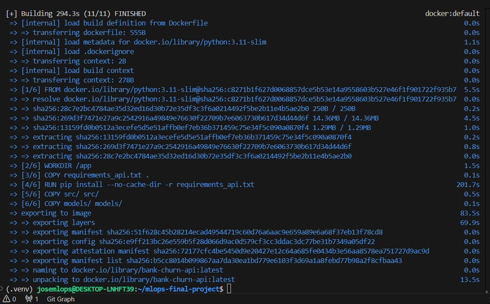
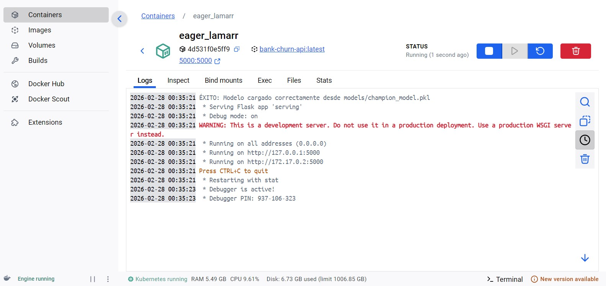

# MLOps Introduction: Final Project
Final work description in  the [final_project_description.md](final_project_description.md) file.

Student info:
- Full name: Jose Antonio Uscuchagua Flores
- e-mail: juscuchaguaf@uni.pe
- Grupo: 1

## Project Name: [Bank Customer Churn Prediction using MLOps]

### Phase A: Problem Definition & Dataset Overview
This project implements a complete Machine Learning Operations (MLOps) pipeline to predict customer churn in a banking institution. The goal is to identify which customers are most likely to close their accounts, allowing the bank to take preventive retention actions.

**Dataset & Variables** The project utilizes historical banking data, which includes demographic information (e.g., `Age`, `Geography`, `Gender`) and financial behavior metrics (e.g., `CreditScore`, `Balance`, `NumOfProducts`, `IsActiveMember`). The target variable is `Churn` (1 if the customer left, 0 if they stayed).

### Phase B: Project Preparation
The project follows a standard modular Data Science structure, managed via Git and GitHub, ensuring a clear separation between raw data, notebooks, source code, models, and reports.

### Phase C: ML Experimentation
During the experimentation phase, multiple algorithms were evaluated (Logistic Regression, Random Forest, XGBoost) using Jupyter Notebooks. The definitive champion model was **XGBoost**, achieving an **F1-score of 0.58** on the test data. 

**MLflow Tracking & Registry:**
Experiments were tracked using MLflow. The champion model has been successfully registered in the platform for versioning and production control:

**Model Evaluation Results:**
Below are the key evaluation metrics visualized for the champion model:

* **Confusion Matrix:**

> **Business Interpretation:** As observed in the matrix, the model successfully identifies 244 customers who are likely to churn (True Positives), allowing the bank to proactively target them with retention campaigns. However, it misses 163 churners (False Negatives). The high number of correctly identified loyal customers (1406 True Negatives) is consistent with the imbalanced nature of the dataset, where the model naturally biases towards the majority class.

* **Feature Importance**

> **Business Interpretation:** The analysis reveals that the number of products a customer holds (`NumOfProducts`) is by far the strongest predictor of churn. This is followed closely by their engagement level (`IsActiveMember`) and their `Age`. Furthermore, being located in Germany (`Geography_Germany`) appears to be the most influential geographic factor. From a business perspective, these insights suggest that the bank should focus its retention strategies on cross-selling to increase product adoption, boosting day-to-day engagement, and creating customized campaigns for specific age demographics.

### Phase D: ML Development Activities
Modular Python code(`src/`) was created for automated data preparation (`data_preparation.py`) and model training (`train.py`). The final model, along with its preprocessing pipeline, has been serialized (`champion_model.pkl`) and is ready for production.

A detailed description of all features (variables) used in the final training dataset can be found in the [Data Dictionary](data/data_dictionary.md).

### Phase E: Model Deployment & Serving
The final XGBoost model has been deployed using a REST API built with **Flask**.

Example of a successful request using `curl`:

### Phase F: Delivery & Best Practices
The final project has been packaged and delivered following industry MLOps best practices:
* **Centralized Documentation:** This `README.md` serves as the central hub, linking to relevant scripts, notebooks, data dictionaries, and visual reports.
* **Version Control:** All development was conducted on dedicated feature branches (e.g., `feature/fase-e-api`, `docs/fase-f-delivery`) and merged into the `main` branch via structured Pull Requests.
* **Reproducibility:** The repository contains all necessary code, datasets (`data/raw/`), and serialized models (`models/`) to reproduce the complete pipeline.

---

## Proyect Wrap-Up: Conclusions, Insights & Lessons Learned

Based on the complete execution of the MLOps pipeline, we have summarized the following key takeaways:

### 1. Conclusions & Predictive Results
* The **XGBoost** algorithm outperformed baseline models, becoming the champion model.
* The model successfully identifies a significant portion of true churners (244 True Positives). However, achieving an **F1-Score of 0.58** (below the initial 0.75 target) reflects the complex and highly imbalanced nature of real-world banking data. It establishes a solid v1.0 baseline for production.
* The entire pipeline, from data ingestion to API serving, was successfully automated and containerized.

### 2. Business Insights
* **Product Adoption is Key:** The feature `NumOfProducts` is by far the strongest predictor of churn.
* **Engagement Matters:** `IsActiveMember` and `Age` heavily influence the probability of a customer leaving.
* **Strategic Action:** The bank should focus its retention strategies on cross-selling to increase product adoption and creating customized campaigns to boost day-to-day engagement, specifically targeting high-risk age demographics and regions (like Germany).

### 3. Limitations
* **Class Imbalance:** The high number of correctly identified loyal customers (1406 True Negatives) versus missed churners (163 False Negatives) shows that the model still struggles slightly with the minority class, naturally biasing towards the majority.

### 4. Future Improvements
* **Advanced Resampling:** Implement techniques like SMOTE or ADASYN to handle the dataset's severe class imbalance.
* **Hyperparameter Tuning:** Automate hyperparameter optimization using tools like Optuna during the MLflow tracking phase to push the F1-Score closer to the 0.75 goal.
* **CI/CD Pipeline:** Implement GitHub Actions to automate testing and Docker image builds upon every new commit to the main branch.

### 5. Lessons Learned
* **The Power of Containerization:** Implementing **Docker** was crucial. Wrapping the Flask REST API and its dependencies in a `python:3.11-slim` image eliminated the classic "it works on my machine" problem, ensuring a lightweight, isolated, and highly reproducible deployment environment.
* **Tracking is Non-Negotiable:** Using MLflow from the early stages of experimentation saved significant time when comparing model versions and metrics, proving that MLOps practices are essential even in the research phase.

---

### Extra Initiatives: Docker Success Evidence
As an additional initiative, the deployment was fully containerized:
- [x] **Docker Containerization:** Implemented for a reproducible serving environment.

* **Build Process:** The image was built successfully including all ML engines (XGBoost, Scikit-Learn, Pandas).

* **Image Registry:** `bank-churn-api` registered in Docker Desktop.

* **Container Running:** The API is successfully serving the model.
